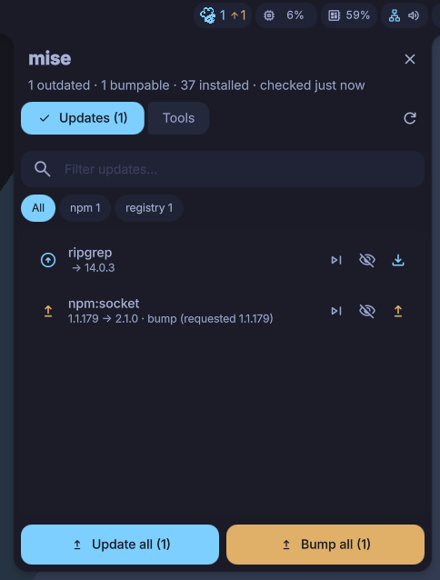
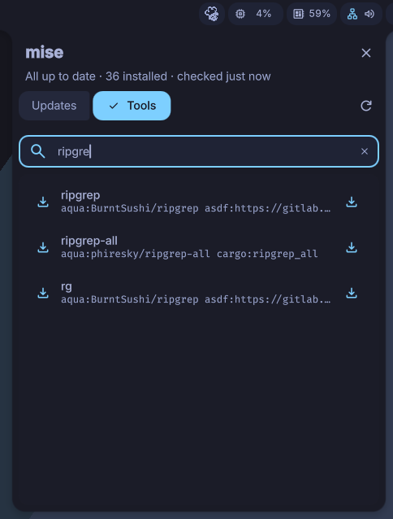

# mise for DankMaterialShell

Install, update and remove [mise](https://mise.jdx.dev) tools from DMS.

Composite plugin: a **DankBar widget**, a **keybind panel** (same UI, no bar needed) and a **launcher** (`mise` trigger).

| Updates | Tools |
| :---: | :---: |
|  |  |

## Widget

Pill with a chef hat icon. Two counters appear next to it: updates (primary colour) and bumps (orange, with an up arrow). The icon is primary when updates are pending, orange when only bumps are; it turns red if the check fails and blinks while mise is working.

Click it for the popout:

- **Updates**: outdated tools (`current → latest`), filter box, backend chips, per-tool download button, and **Update all** at the bottom. If some tools are pinned or have a newer major, **Bump all** appears next to it (click twice to confirm).
- **Tools**: your installed tools (version, remove). Type to search installed tools and the mise registry; the download icon installs. Enter installs the first result not yet installed.
- Refresh button checks on demand: the icon spins on hover and the button turns into a spinner while checking (held briefly so quick checks stay visible). A banner shows what mise is doing and its last output line; failures show the last lines of output in a toast.

Each update row can be **skipped** (`skip_next`: that target version only, it shows again when a newer one appears) or **ignored** (`visibility_off`: the tool, whatever the version). Ignored items are not counted in the badge and are left out of *Update all*, *Bump all* and the launcher. The `ignored N` chip lists them with an undo button. Also listed, with undo and *Clear all*, in Settings → Plugins → mise. Stored in the plugin state (`~/.local/state/DankMaterialShell/plugins/mise_state.json`), not in your mise config. Handy for a release that fails to install (e.g. a badly published npm package that `aube` rejects).

Remove is two steps: bin icon, then the red check.

## Keybind panel

A panel you can bind to a key, with the same **Updates** and **Tools** tabs as the widget's popout. It opens on Updates when something is pending (updates or bumps) and on Tools otherwise; Settings → *Keybind panel opens on* can pin it to Updates or Tools. Two looks, chosen in Settings → Plugins → mise → *Keybind panel*:

- **Overlay** (default): DMS's centered modal. It closes on a click outside, and you can drag the header to move it (double-click recenters; kept until the shell restarts). No compositor border, only DMS's own.
- **Window**: a real floating window, like DMS's System Monitor. The border and rounding come from your compositor config, and it moves and resizes like any other window (drag the header or use your window-move binding; double-click the header to maximize). Window class `com.danklinux.dms`, title `mise`, if you want a window rule. Tested on Hyprland only; the compositor has to float DMS windows.

In both: the search field is focused on open; Esc, the close button or the same keybind closes it.

```sh
dms ipc call mise toggle   # also: open, close
```

Hyprland (Lua config, 0.55+):

```text
hl.bind("SUPER + CTRL + M", hl.dsp.exec_cmd("dms ipc call mise toggle"))
```

Hyprland (`hyprland.conf`):

```text
bind = SUPER CTRL, M, exec, dms ipc call mise toggle
```

niri:

```text
Mod+M { spawn "dms" "ipc" "call" "mise" "toggle"; }
```

Row buttons need the mouse; Enter in the search field installs the first result not yet installed. For a fully keyboard-driven flow use the launcher below.

## Launcher

`mise` + query: upgrades for outdated tools (empty query also offers *Upgrade all*), installs from the registry or any `backend:tool`. Installed tools can be removed with Tab / right-click → *Remove*. With *Project tools* on, that menu also lists one *Install in / Remove from `<project>`* entry per followed project, and upgrade rows carry the project name.

## Project tools

By default the plugin only manages the **global** config. Turn on *Project tools* in Settings to also list, update, bump, install and remove tools declared in project configs (`mise.toml`, `.mise.toml`, `.config/mise/config.toml`, ...):

| Mode | Projects followed |
| --- | --- |
| Off (default) | none, nothing changes |
| Manual | only the ones you add |
| Tracked | every config mise has already seen (`<state dir>/tracked-configs`, existing files only, the global config and `/tmp` skipped) plus the ones you add |

Add a project from Settings → *Projects* (**Browse** or type the path), or from the popout: scope button → *Add project…* opens DMS's folder browser; the keyboard icon on that row lets you paste a folder or a config file path instead (`~` works). Either way it is checked before it is saved, and a folder without a mise config is rejected. The **x** next to a project in the scope menu (or the list in Settings) stops following it. That only edits the plugin's list: a tracked project is hidden (undo in Settings), and no config file is ever touched.

In the popout, the scope button next to refresh opens a menu: **Global** (the default, so nothing changes until you pick something else), **All** or one project. *Update all* and *Bump all* act on the picked scope, and **Install writes to the picked project** (to global when *All* is selected). Rows show where they come from when *All* is selected. Only the tools a project config declares are listed for it; inherited global tools stay under *Global*.

The bar badge counts **Global** only by default; *Bar badge counts* in Settings switches it to global + the projects you follow. The popout's header, tab count and *Update all* always follow the scope picked in its menu, and a dot on the scope button (plus a hint in the empty list) tells you when another scope has something pending.

The tracked list is mise's internal state, not a stable API. If it ever changes shape, *Tracked* finds nothing and *Manual* keeps working.

## Installing anything, with options

The registry is only a curated subset. Type any `backend:tool` and use it as-is:

```text
pipx:package
npm:package
cargo:crate
github:Owner/repo
```

Tool options go in brackets, exactly as `mise use` accepts them:

```text
pipx:package[uvx_args=--python 3.14]
npm:package[allow_builds=["node-pty"]]
```

They are written to the config as an inline table and kept on updates. Text is passed unchanged, so it is case-sensitive.

Pin a version with `@`: `ripgrep@14.0.3` or `pipx:package@1.2`. The version part is *not* a prefix filter, it is what `mise use` writes, so `@14.0.3` pins exactly and `@14` follows the latest 14.x. (The separator is `@`, not `:`.) Entries with a version or options always show as installable, even if the tool is already installed, so you can re-pin or reconfigure it.

### Details and versions

The info button on a Tools row expands it in place (one row at a time): description, backend, installed versions, a `latest` chip, and the latest 20 versions from the backend. The active version has a highlighted border, installed ones a ✓. Click a version to pin it (`mise use <tool>@<version>`, in the same scope as Install), which also lets you go back to an older release. `latest` writes `@latest`, so the tool follows the newest release. Answers are cached until the panel is reloaded; a failed lookup is retried when you reopen the row.

Installed versions other than the active one carry a trash icon: click it, then click again to remove just that version (`mise uninstall tool@version`, the config is not touched). Installed versions too old to be in the latest 20 are listed as well. When a tool has versions that no tracked config uses, a *Prune N unused* button removes them. The Tools tab also gets a *Prune unused versions* button at the bottom for all tools. Pruning follows every config mise has tracked, not only the scope you picked.

### Live search and verification

Beyond the registry, typing in Tools (or the launcher) also queries the package sites, debounced (350 ms, 3+ characters):

- **free text**: registry (12) plus npm and crates.io (5 each), shown as `npm:name` / `cargo:name` with the description
- **`backend:q`**: that backend only, up to 15 hits. Searchable: `npm`, `cargo`, `github` (no `/`), `gem`, `dotnet`, `pipx` (`pypi:` is read as `pipx:`, mise has no `pypi` backend) and `go` (see below), `conda` (conda-forge only: anaconda.org searches every channel and takes 1-3 s). Other backends are not searched freely so plain text does not drown in results (GitHub also allows only 10 searches a minute unauthenticated)
- a typed `backend:tool` is checked against the site: `✓ description` or `✗ not found`. Verified: `npm`, `cargo`, `pipx`/`pypi`, `gem`, `conda` (conda-forge), `dotnet`, `go` (module path), `aqua`, `github`, `ubi`, `spm`, `gitlab` (`owner/repo`). A hint only, Enter still installs (private registries). When a search hit is the same package as what you typed (any capitalization; `-`/`_` for cargo), the two are one row, with the hit's canonical name and description. Entries with `@version` or `[options]` always stay as typed

No search for `aqua`, `gitlab` (search is unranked noise), `ubi`, `spm`, `http`, `s3`, `asdf`, `vfox`: exact name only, or use the registry. GitHub `owner/repo` checks use the unauthenticated API (60/hour); a rate-limited answer just shows no ✓/✗. PyPI and Go have no search API (PyPI's was disabled in 2021 and `pypi.org/search` sits behind a JavaScript challenge), so `pipx:q`, `pypi:q` and `go:q` use the search behind [deps.dev](https://deps.dev)'s own website (Google's Open Source Insights): a plain JSON endpoint, ranked by relevance, no key. It is **unofficial and undocumented**, so it may change or disappear without notice; if it fails there are simply no hits for those backends and the exact-name check still works. Rows show the latest version, not a description. Turn all of this off in Settings (*Live search and verification*): only the registry is used and nothing you type leaves your machine.

## Settings

Settings → Plugins → mise: check interval (15 min, 30 min, 1 h, 4 h, daily). Default 30 min. Also: keybind panel mode and tab, pinned/major updates, live search toggle, project tools (off / manual / tracked) and the project list.

## What it runs

| Action | Command |
| --- | --- |
| Check | `mise outdated --json`, `mise outdated --bump --json`, `mise ls --json` (and the same with `-C <project>` per followed project) |
| Registry | `mise registry` (once, at load) |
| Live search | `curl` to registry.npmjs.org, crates.io, api.github.com, pypi.org (only while typing, see above) |
| Update | `mise upgrade --yes [tool]` (`mise -C <project> upgrade ...` for a project) |
| Bump | `mise upgrade --bump --yes <tool>` (same `-C`) |
| Install | `mise use --global --yes <tool>`, or `mise use --path <config> --yes <tool>` for a project |
| Details | `mise tool --json <tool>`, `mise ls-remote <tool>` (30 s timeout, only when a row is expanded) |
| Remove a version | `mise uninstall --yes <tool>@<version>` |
| Prune | `mise ls --prunable --json` (with every check), `mise prune --tools --yes [tool]` |
| Remove | `mise unuse --global --yes <tool>`, or `mise unuse --path <config> --yes <tool>` for a project |

One job at a time.

## Limits

- Without a project selected, `install` and `remove` write the **global** mise config (`~/.config/mise/config.toml`). If that file is managed (chezmoi, home-manager) it ends up dirty or read-only. Project installs write that project's `mise.toml`, so they show up in git.
- `remove` only works on the config you pick: a tool declared only in a project fails on *Global* (and the other way round) with mise's error.
- Project configs that mise does not trust may fail to load; that project then shows nothing.
- `mise upgrade` respects the requested version (`node = "22"` never goes to 24, an exact pin never moves). Those show as **bump** rows (warning icon, from `mise outdated --bump`) with their own button, which runs `mise upgrade --bump <tool>` and rewrites the version in the config that declares the tool. Bumps are not counted in the badge and are never part of *Update all*. Turn them off in Settings.
- It does not update the mise binary itself. If mise comes from nix/a package manager, update it there.
- Old inactive versions are not pruned. Skipped versions that were superseded stay in the ignored list until you undo them.
- No install-time options UI: use the bracket syntax above.
- Toast duration is controlled by DMS.

## Development

```sh
ln -s "$PWD" ~/.config/DankMaterialShell/plugins/mise
dms ipc call plugins reload mise
```

`reload` is enough for `MiseBar.qml` / `MiseLauncher.qml` / `MiseDaemon.qml` edits. `MiseService.qml` is a singleton and `MisePanel.qml` is registered, both through `qmldir`, and `plugin.json` is read at scan time: for those, run `dms restart`.

Logo: `assets/mise.svg`, from <https://mise.jdx.dev/logo.svg>. The bar pill uses the `chef_hat` icon from Material Symbols instead: the logo line art is too fine to read at bar size.

## License

[MIT](LICENSE)
